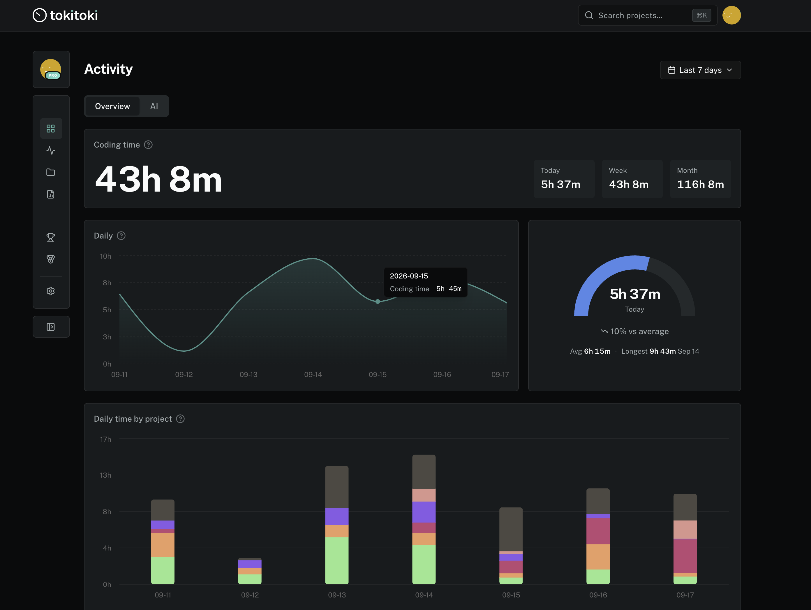

# Tokitoki for JetBrains IDEs

Coding time from your IDE and the token usage of AI coding agents, per
project, at [tokitoki.dev](https://tokitoki.dev). Works in IntelliJ IDEA,
PyCharm, WebStorm, GoLand, Rider, CLion, RubyMine, PhpStorm, DataGrip and
Android Studio, 2024.2 or newer.

## What it does

- Records which files, projects and languages you work in, and for how long.
  Debugging and reviewing a diff are recorded as such.
- Reads the local logs that Claude Code, Codex, GitHub Copilot, Gemini CLI
  and [other tools](https://github.com/tokitoki-dev/tokitoki-cli#supported-tools)
  already write, and syncs them every five minutes.
- Shows today's time for the open project in the status bar, and the week
  in a Tokitoki tool window.
- Queues everything locally and uploads when you are online.

Only metadata leaves your machine: paths, project names, timestamps, token
counts. Never your code. Apache-2.0.

## Setup

1. Install the plugin from the JetBrains Marketplace.
2. Tools > Tokitoki > Set API Key, and paste the key from
   [tokitoki.dev](https://tokitoki.dev). The plugin also asks on first use.

## Tools > Tokitoki

| | |
| --- | --- |
| Open Dashboard | The web dashboard, signed in |
| Set API Key | One key for every Tokitoki client on this machine |
| Show API Key Status | The configured key, masked, checked against the server |
| Set Project Name | Pins the name this project reports, in its `.tokitoki` file |
| Sync AI Usage Now | Scans your AI tools and uploads right away |

Settings > Tools > Tokitoki turns the status bar item and its figure on or
off. Nothing else needs configuring.

## Links

[Dashboard](https://tokitoki.dev) ·
[Issues](https://github.com/tokitoki-dev/tokitoki-jetbrains/issues) ·
[Development](DEVELOPMENT.md) ·
[Releasing](RELEASING.md) ·
[Other clients](https://github.com/tokitoki-dev)
